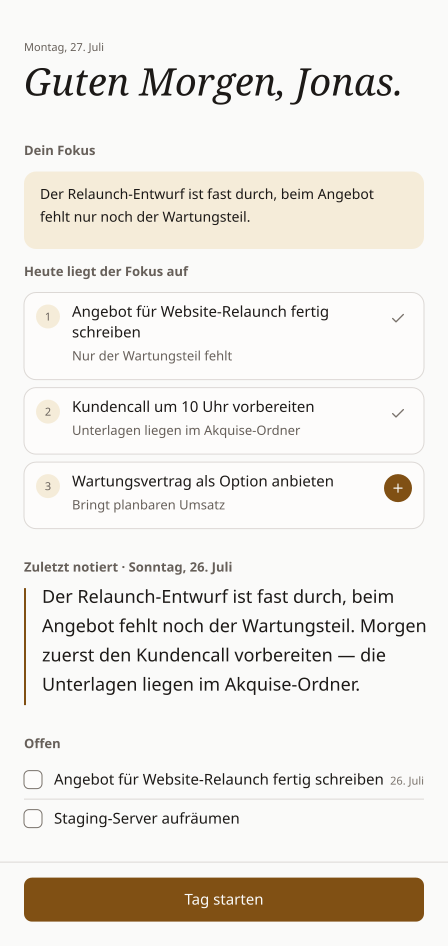

# Handoff

> Abends den Kopf leeren, morgens wieder reinfinden.

Der Tag ist um, der Kopf ist noch voll. Da war noch was mit dem Angebot. Der
Kunde wollte bis Donnerstag eine Antwort. Und dieser eine Gedanke, der dir auf
dem Heimweg kam — der ist morgen früh weg.

Handoff ist die Übergabe an dein Morgen-Ich. Abends zwei Minuten erzählen, was
war und was ansteht. Am nächsten Morgen liegt es da, wenn du den Laptop
aufklappst. Ohne dass du eine App öffnen, suchen oder dich erinnern musst.

  

So sieht der Morgen aus.

**[→ Herunterladen für Windows und macOS](../../releases/latest)**

## Wo es hilft

**Montagmorgen.** Freitag ist drei Tage her und fühlt sich an wie drei Wochen.
Handoff zeigt dir die Notiz von Freitag und was du da geschafft hast. Hast du
den Tag ohne Notiz abgeschlossen, sagt es dir genau das — statt dir eine
ältere unterzuschieben.

**Nach ein paar Tagen weg.** Urlaub, krank, Konferenz. Der Wiedereinstieg ist
kein Archäologie-Projekt mehr.

**Wenn du zwischen Projekten springst.** Vormittags Kunde A, nachmittags Kunde
B — und am nächsten Tag weißt du nicht mehr, wo du bei A stehengeblieben bist.

**Wenn du abends nicht abschalten kannst.** Weil du ahnst, dass du etwas
vergisst. Aufgeschrieben ist aufgehoben, und der Kopf darf Feierabend machen.

**Wenn Aufgabenlisten zur zweiten Arbeit werden.** Hier gibt es nichts zu
pflegen. Was offen bleibt, wandert von selbst mit.

## So läuft ein Tag

**Abends.** Du klickst auf „Tag abschließen". Die App fragt: *Wie war dein
Tag?* Du schreibst — oder du drückst aufs Mikrofon und redest einfach. Darunter
steht: *Was steht morgen an?* Ein paar Stichworte reichen. Dann: *Tag
abgeschlossen. Genieß den Rest des Tages.*

**Morgens.** Du klappst den Laptop auf, und Handoff ist schon da. *Guten
Morgen.* Deine Notiz von gestern. Was du gestern geschafft hast. Alles, was
offen ist. Und darüber ein kurzer Fokus: die zwei, drei Dinge, auf die es heute
ankommt — jedes mit einem Satz dazu, warum. Ein Klick, und daraus wird eine
Aufgabe für heute.

**Tagsüber.** Handoff ist weg. Es liegt in der Taskleiste bzw. Menüleiste, und
ein Klick öffnet eine kleine Karte zum Abhaken — und zum schnellen Notieren,
wenn dir zwischendurch etwas einfällt. Mehr will es nicht von dir.

Das Beste daran: Du musst nichts davon starten. Das Briefing meldet sich
morgens von selbst, genau einmal, und legt sich kurz über alle Fenster, damit
es nicht untergeht. Und weil der Arbeitstag nicht um Mitternacht endet, endet
er bei Handoff um vier Uhr morgens — wer um halb eins noch tippt, wird nicht
mit einem Briefing für „heute" überrascht.

## Wie es aufgebaut ist

Vier Ansichten, mehr gibt es nicht.

| Ansicht | Wofür |
|---|---|
| **Briefing** | Der Morgen-Screen. Notiz von gestern, was du geschafft hast, offene Aufgaben, dein Fokus für heute. Kommt von selbst. |
| **Heute** | Deine Liste. Was von vorher übrig ist, wartet oben im Backlog — mit Datum, damit du siehst, wie lange es schon mitläuft. Was heute dran ist, ziehst du von dort nach „Heute". |
| **Tag abschließen** | Der Braindump. Ein Feld für den Tag, ein Feld für morgen. |
| **Verlauf** | Alle Braindumps zum Nachlesen, Tag für Tag, mit dem, was du an dem Tag geschafft hast. |

## Was es kann

- **Reden statt tippen.** Abends ist Schreiben oft die Hürde. Drück aufs
  Mikrofon und erzähl einfach — der Text landet im Feld.
- **Aufgaben aus dem Gesagten.** Hast du im Diktat etwas erwähnt, das nach
  einer Aufgabe klingt, schlägt Handoff sie dir vor. Übernehmen oder verwerfen,
  ein Klick. Ungefragt landet nichts in deiner Liste.
- **Ein Fokus, keine Zusammenfassung.** Der Morgen-Fokus nennt dir zwei bis
  drei Dinge und sagt bei jedem dazu, warum es heute dran ist. Per Klick wird
  daraus eine Aufgabe — Doppelte erkennt er selbst.
- **Nichts fällt hinten runter.** Offen ist offen: Aufgaben wandern von allein
  in den nächsten Tag, bis du sie abhakst oder streichst.
- **Große Aufgaben in kleine Schritte.** Jede Aufgabe kann Unteraufgaben
  bekommen. Hakst du die Aufgabe ab, sind ihre Schritte mit erledigt.
- **Eine Erinnerung am Nachmittag**, wenn du sie willst — und nur dann, wenn
  du den Braindump noch nicht gemacht hast.
- **Dunkel, wenn dein System dunkel ist.** Und farbig nur an den Tagesrändern:
  Dämmerungsblau am Abend, Gold am Morgen.
- **Hält sich selbst aktuell.** Neue Versionen meldet die App als Banner und
  installiert sie erst auf deinen Klick.

## Was es bewusst nicht ist

Kein Projektmanagement. Keine Boards, keine Deadlines, keine Prioritätsmatrix,
keine Teams. Kein zweites Gehirn, das erst gepflegt werden will. Keine
Statistik darüber, wie produktiv du gestern warst. Und nichts, wofür du dich
anmelden müsstest.

Handoff macht eine einzige Sache: den Übergang von einem Arbeitstag zum
nächsten.

## Deine Daten bleiben bei dir

Alles liegt in einer Datei auf deinem Rechner. Kein Konto, kein Server, keine
Synchronisierung, kein Abo.

Diktat und Morgen-Fokus sind ab Werk **aus**. Schaltest du sie ein, hast du bei
beiden die Wahl: ein Anbieter im Netz — oder ein Modell, das direkt auf deinem
Rechner läuft. Dann verlässt kein Wort die Maschine. Sprachaufnahmen werden
nach dem Umwandeln gelöscht; gespeichert wird nur Text.

## Los geht's

[Installer herunterladen](../../releases/latest) — `.exe` für Windows, `.dmg`
für macOS (ein Paket für Apple Silicon und Intel).

Handoff ist ein privates Projekt ohne kommerzielles Zertifikat. Beim
**ersten** Start meldet sich deshalb einmalig das Betriebssystem:

- **Windows:** „Der Computer wurde geschützt" → *Weitere Informationen* →
  *Trotzdem ausführen*
- **macOS:** Rechtsklick auf die App → *Öffnen* (statt Doppelklick) → im
  Dialog bestätigen

Danach nie wieder.

---

Für Neugierige: gebaut mit Tauri, React und Rust. Die Sprachnotiz nutzt
wahlweise Whisper (lokal) oder OpenRouter, der Morgen-Fokus wahlweise Ollama
(lokal), die Claude API oder OpenRouter. Illustrationen von
[unDraw](https://undraw.co) (© Katerina Limpitsouni), Schriften
[Archivo](https://github.com/Omnibus-Type/Archivo) und
[Amiri](https://github.com/aliftype/amiri) unter der SIL Open Font
License.
